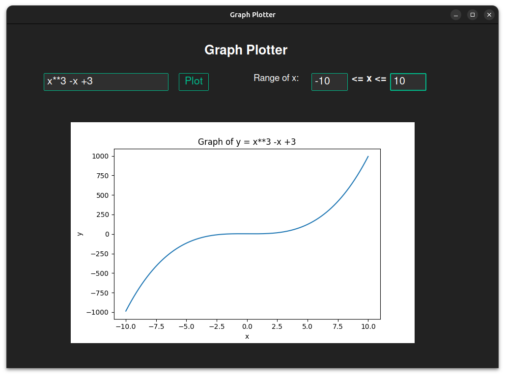

# Graph Plotter

Description

This is my first project in mathematical visualizations using Python. The application is a simple Graph Plotter built with Tkinter for the user interface and Matplotlib for rendering mathematical graphs. Users can input mathematical functions, specify a range for the x-axis, and visualize the corresponding graph directly within the application.
Features

  Dynamic Input:
      Accepts user-defined mathematical expressions (e.g., x**3 - x + 3).
  Customizable Range:
      Users can specify the start and end values of the x-axis range.
  Graph:
      Displays a dynamically generated graph based on the input function and range.
  Clean User Interface:
      Simple, dark-themed UI for easy readability.

Technologies Used

  Python: The core programming language.
  Tkinter with ttkbootstrap: For the GUI.
  Matplotlib: For plotting the mathematical functions.
  NumPy: To handle the range of x-values.

How It Works

  Enter a mathematical function of x (e.g., x**2 - 4*x + 5) in the input field.
  Define the range of x-values by providing the start and end points.
  Click the "Plot" button to display the graph of the function.
  The graph is rendered in a designated area within the application.

Challenges Faced

  Handling dynamic user input:
      Parsing mathematical functions entered as strings.
      Ensuring safe evaluation of user-provided expressions.
  Integrating Matplotlib with Tkinter:
      Embedding a dynamic graph display within the Tkinter UI.
  Creating a user-friendly design:
      Ensuring the layout is clean and easy to navigate.
      Aligning input fields and plot areas efficiently.

What I Learned

  Basics of Tkinter's grid and place layout systems.
  How to use Matplotlib to generate and customize plots.
  Techniques for securely evaluating user input in Python (eval with a controlled context).
  How to integrate external libraries (like Matplotlib) into GUI applications.

## How it looks 


## How to Run the Application

Install the required Python libraries:
```
pip install -r requirements.txt
```

Run the application:
```
python3 main.py
```

Enter your desired mathematical function and range, then click Plot to see the graph!

